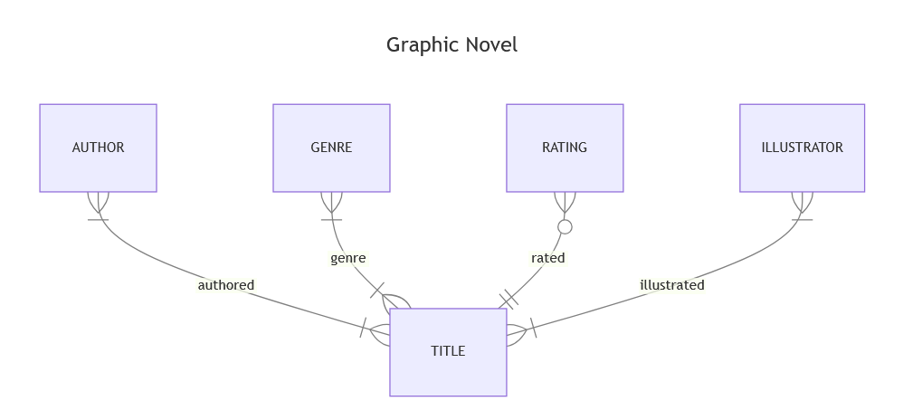

# Design Document

By Piyush Mishra

Video overview: <[URL HERE](https://youtu.be/4vAcJFktMDI)>

## Scope

* Using the database one can find about the Graphic Novels such as author, illustrator or if the novel is finished or ongoing and ratings for peoples to easily find what they are looking for when they want to read a novel.
* The Database includes authors and illustrators of Graphic Novels, and when it was started and ended, ratings and episodes the novel have.
* It doesn't include the translators and publishers of the novel and on which site/service the novel is available to read.

## Functional Requirements

* The user can search for novels out of thousands to read based on genres, ratings or authors.
* The database cannot provide the novel itself or more information about authors and illustrators such contact information.

## Representation

Entities are captured in SQLite tables with the following schema.

### Entities

The database includes the following entities:

#### Authors

The `authors` table includes:

* `id`, which is unique ID for the author of type `INTEGER` and have `PRIMARY KEY` constraint.
* `name`, which is name of the author of type `TEXT`, here this data type is appropriate for name feild.
* `birth`, which is birth date of the author in format `YYYY-MM-DD` of type `NUMERIC`, this datatype is suitable for date objects in SQLite.
* `death`, which is death date of the author in format `YYYY-MM-DD` of type `NUMERIC`, this datatype is suitable for date objects in SQLite.

#### Illustrators

The `illustrators` table includes:

* `id`, which is unique ID for the illustrator of type `INTEGER` and have `PRIMARY KEY` constraint.
* `name`, which is name of the illustrator of type `TEXT`, here this data type is appropriate for name feild.
* `birth`, which is birth date of the illustrator in format `YYYY-MM-DD` of type `NUMERIC`, this datatype is suitable for date objects in SQlite.
* `death`, which is death date of the illustrator in format `YYYY-MM-DD` of type `NUMERIC`, this datatype is suitable for date objects in SQlite.

#### Titles

The `titles` table includes:

* `id`, which is unique ID for the title of type `INTEGER` and have `PRIMARY KEY` constraint.
* `title`, which is name of the graphic novel of type `TEXT`, here this data type is appropriate for title feild. `NOT NULL` constraint make sure that name is given.
* `chapters`, which is number of chapters the graphic novel have, it have `INTEGER` type which is approriate for chapters field. `NOT NULL` constraint make sure that number of chapters is given.
* `status`, this shows if the graphic novel is ongoing or finished thats why it have `CHECK` constraint to check the column can only have `ongoing` and `finished` as value.
* `type`, shows the type of novel, it uses `CHECK` constrain to make sure column only have `western comic`, `manga`, `manhwa` as value and have `TEXT` type as it is approriate for this column.
* `start_date`, which is the date when the first chapter of novel was published. `NUMERIC`, datatype is suitable for date objects in SQlite. This feild cannot not be null which is ensured by `NOT NULL` constraint.
* `end_date`, which is the date when the last chapter of novel was published. `NUMERIC`, datatype is suitable for date objects in SQlite.

#### Authored

The `authored` table includes:

* `author_id`, which is the id of author who wrote the novel of given id. It has `FOREIGN KEY` constraint which refers to the id column of authors table.
* `title_id`, which is the id of novel which is written by author of given id. It has `FOREIGN KEY` constraint which refers to the id column of titles table.
* Both `author_id` and `title_id` have combined `PRIMARY KEY` constraint which makes sure that a particular combination of author and novel doesn't occur in the table more than once.

#### Illustrated

The `illustrated` table includes:

* `illustrator_id`, which is the id of illustrator who illustrated the novel of given id of type `INTEGER`. It has `FOREIGN KEY` constraint which refers to the id column of illustrators table.
* `title_id`, which is the id of novel which is illustrated by author of given id of type `INTEGER`. It has `FOREIGN KEY` constraint which refers to the id column of titles table.
* Both `illustrator_id` and `title_id` have combined `PRIMARY KEY` constraint which makes sure that a particular combination illustrator and novel doesn't occur in the table more than once.

#### Ratings

The `ratings` table includes:

* `title_id`, which is the id of novel which has the given rating by one individual of type `INTEGER`. It has `FOREIGN KEY` constraint which refers to the id column of titles table.
* `rated`, which is the rating provided by a single individual for the given novel id of type `INTEGER`. This field cannot be null and must have non negative value, which is both ensured by `NOT NULL` and `CHECK` constraints.

#### Genres

The `genres` table includes:

* `title_id`, which is the id of novel which has the given genre of type `INTEGER`. It has `FOREIGN KEY` constraint which refers to the id column of titles table.
* `genre`, which is the genre of the given novel id. It has `TEXT` and `NOT NULL` constraints.

### Relationships

The below entity relationship diagram describes the relationships among the entities in the database.

Overview of Diagram:

* One author can have either one or multiple titles, similarly a single title may have one or more authors(co-authors). The author need to have atleast one title unless he is not author.
* Illustrators also have similar case as authors, one illustrator can have one or multiple titles illustrated, and one title may have been illustrated by multiple illustrators. The illustrator need to have atleast one title illustrated unless he is not illustrator.
* One title can be of one or many genres ex: horror, thriller. And one genre can have many titles.
* A title can have many individual ratings or may no ratings. But for rating to be called, it must be given to atleast one title. This may depend on how you define the rating, its your personal choice, i here chose that one rating can have only one title.

## Optimizations

* As the most common query will be to find an novel by its name or either the author's name. That is why i have created `search_titles_by_title` and `search_authors_by_name` indexes to fast up the search. Even though its not common for an user to search for the illustrator i have still included the `search_illustrators_by_name` index. Also its very common for users to search novels by genres so i have included `search_by_genre` index.

The DB have following views:

* `ongoing`, which shows all the graphic novels which are currently ongoing.
* `finished`, which shows all the graphic novels which are finished.
* `average_title_ratings`, whichs shows average ratings of all the graphic novels in the DB.

## Limitations

The database lacks to show the ratings of graphic novels on different sites. Also it doesn't tell if a novel is abandoned. It cannot show the popularity of a graphic novel, means how many peoples read it.
